# 🔐 Brute Force Attack Detection using Splunk (Windows + Linux)

🚨 Simulated brute force attacks using Hydra and detected them in Splunk across Windows and Linux environments.

---

## 📌 Overview

This project demonstrates how to detect brute force authentication attempts across heterogeneous systems using Splunk.

It simulates real-world attack scenarios and implements detection, alerting, and visualization—mirroring workflows used in a Security Operations Center (SOC).

---

## 🎯 Objectives

* Simulate brute force attacks on Linux (SSH) and Windows (RDP)
* Ingest and analyze logs in Splunk
* Detect suspicious authentication patterns using SPL
* Create alerts for real-time monitoring
* Build dashboards for threat visibility

---

## 🧪 Attack Simulation

Brute force attacks were generated using Hydra from a Kali Linux machine.

### 🔹 SSH Brute Force (Linux Target)

```bash
hydra -l kayode -P /usr/share/wordlists/rockyou.txt ssh://192.168.200.30 -t 5
```

### 🔹 RDP Brute Force (Windows Target)

```bash
hydra -l seun -P /usr/share/wordlists/rockyou.txt rdp://192.168.200.20 -t 5
```

---

## 📥 Data Sources

| Source  | Description                                         |
| ------- | --------------------------------------------------- |
| Linux   | `/var/log/auth.log` (SSH failed logins)             |
| Windows | Security Event Logs (EventCode 4625 - Failed Login) |

---

## 🔍 Detection Strategy

Brute force activity is identified based on:

* Repeated failed authentication attempts
* Multiple attempts from a single source IP
* Targeting one or more user accounts
* Threshold-based detection (≥ 5 attempts)

---

## 💻 SPL Detection Query

```spl
index=* ("Failed password" OR "4625")
| rex "from (?<src_ip>\d+\.\d+\.\d+\.\d+)"
| rex "for (invalid user )?(?<user>\w+)"
| eval user=coalesce(Account_Name, user)
| eval src_ip=coalesce(Source_Network_Address, src_ip)
| stats count by src_ip, user
| where count >= 5
| sort - count
```

---

## 🚨 Alert Implementation

An alert was configured to trigger when brute force behavior is detected.

**Configuration:**

* Type: Scheduled
* Frequency: Every 5 minutes
* Trigger Condition: Number of Results > 0
* Purpose: Detect and notify on active brute force attempts

---

## 📊 Dashboard Overview

A Splunk dashboard was created to visualize brute force activity across systems.

### 🔹 Top Attacking IPs
Identifies source IP addresses generating the highest number of failed login attempts.
<p align="left">
  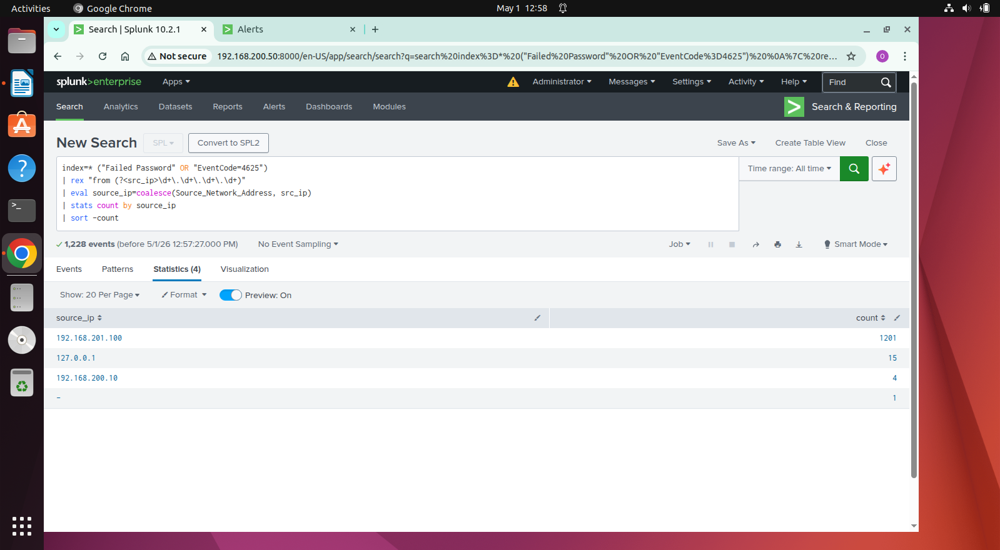  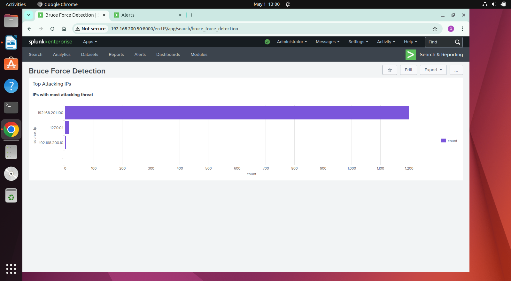
</p>
---

### 🔹 Targeted Users
Shows user accounts most frequently targeted during brute force attempts.
<p align="left">
  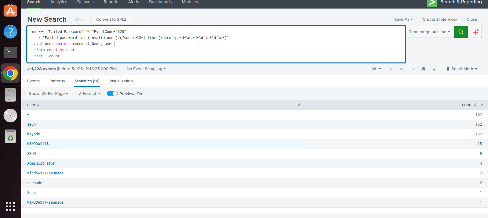  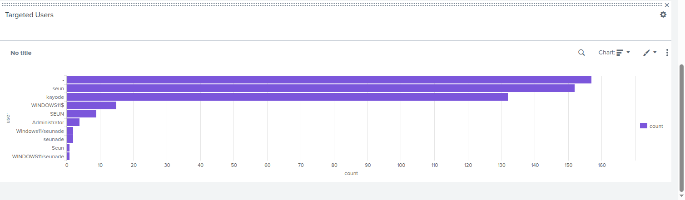
</p>
---

### 🔹 Activity Over Time
Displays the trend of failed authentication attempts over time.
<p align="left">
  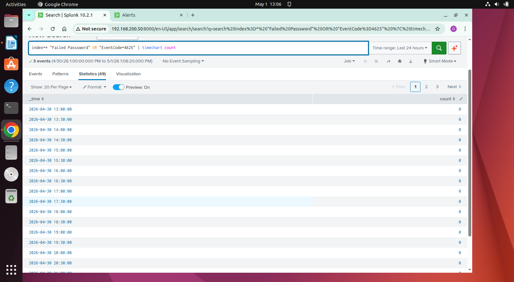  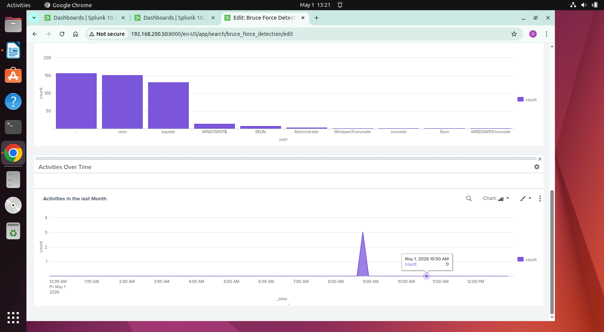
</p>
---

## 📸 Screenshots

### 🔹 Attack Simulation

<p align="left">
  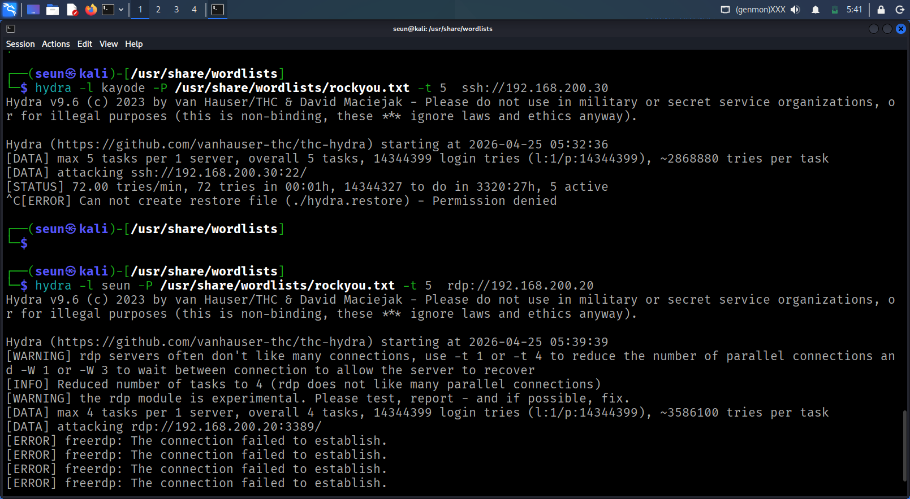  
</p>

### 🔹 Linux Failed Login Events

<p align="left">
  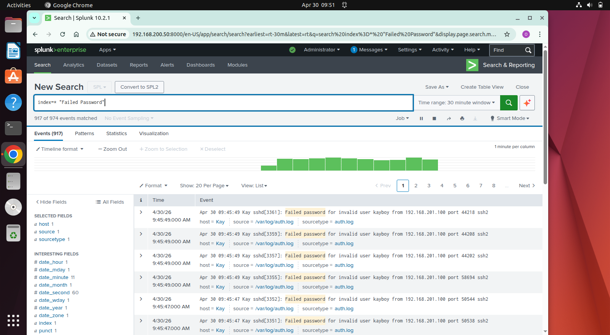  
</p>

### 🔹 Windows Failed Login Events
<p align="left">
  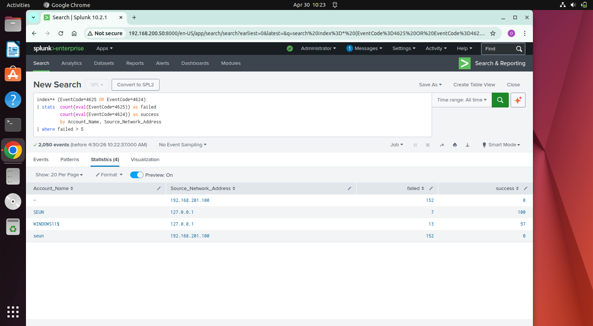 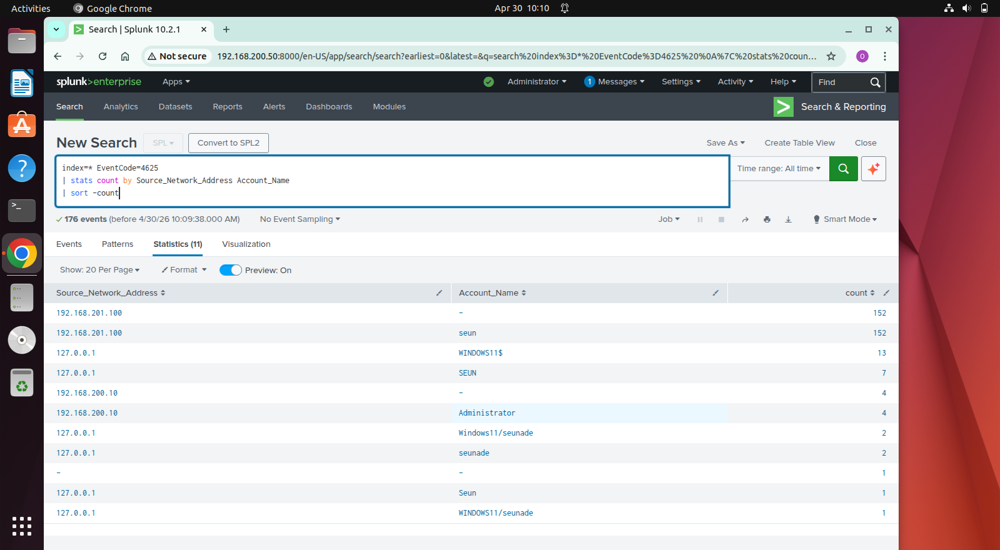  
</p> 

### 🔹 Detection Results

<p align="left">
  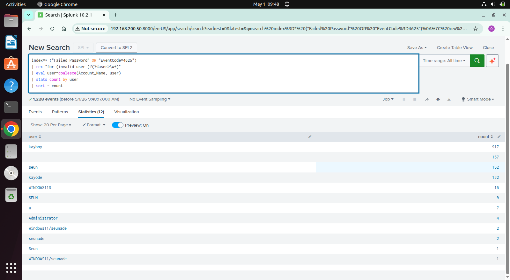  
</p>

### 🔹 Alert Configuration
<p align="left">
  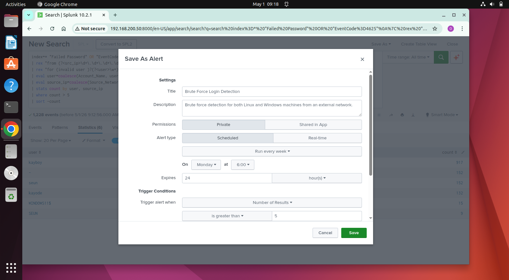  
</p>

### 🔹 Dashboard View

<p align="left">
  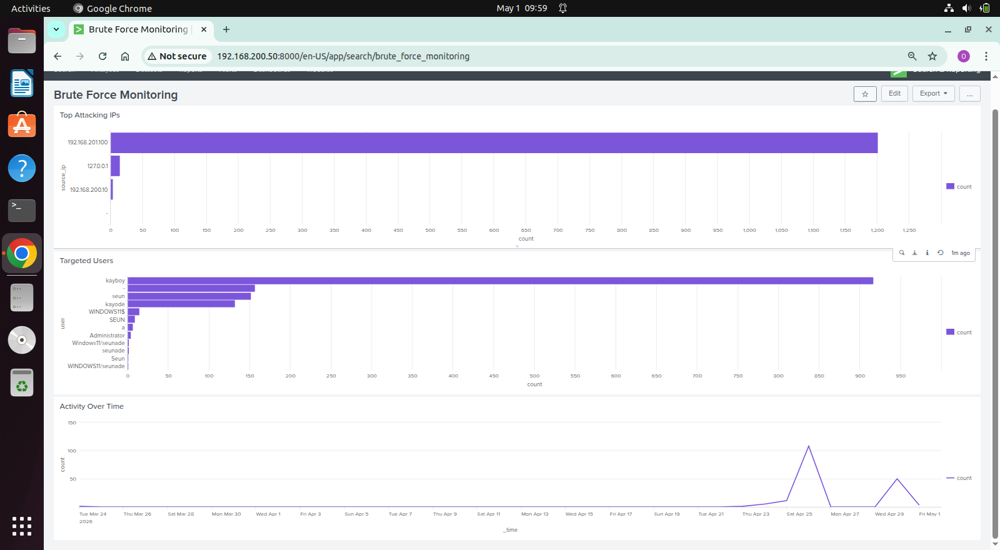
</p>

---

## 🔎 Key Findings

* A single source IP generated a high volume of failed login attempts
* Multiple user accounts were targeted (e.g., `kayode`, `seun`)
* Attack patterns clearly matched brute force behavior
* Detection logic successfully identified and flagged the activity

---

## ⚠️ Limitations

* Linux logs required regex-based field extraction (`rex`)
* No centralized field normalization (CIM not implemented)
* Detection is threshold-based (no behavioral anomaly detection)

---

## 🚀 Future Improvements

* Implement **Splunk CIM (Common Information Model)**
* Use **field extraction via props.conf / transforms.conf**
* Add **correlation rules across multiple data sources**
* Introduce **time-based and behavioral detection logic**

---

## 🧠 Skills Demonstrated

* SIEM (Splunk) log analysis
* Threat detection using SPL
* Cross-platform log correlation (Windows & Linux)
* Alerting and monitoring
* Security dashboard design

---

## 🎯 Conclusion

This project demonstrates practical SOC-level detection capabilities by combining attack simulation, log analysis, and monitoring within Splunk. It highlights the ability to detect and respond to brute force attacks in a real-world environment.

---

## 👤 Author

**Seun**
Cybersecurity Analyst | SOC Enthusiast
